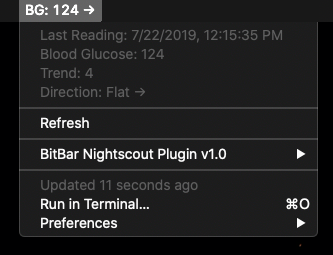

# BitBar Nightscout Plugin

A plugin for [BitBar](https://getbitbar.com/) which gets the most recent reading and trend arrow from your nightscout site



## Configuration

Edit the script and change the values of the following variables to match your nightscout site:

```
const HOSTNAME = 'your_nightscout_site.herokuapp.com'
const TOKEN = 'your_nightscout_api_token_with_read_access'
const BG_HIGH_LEVEL = 180  // if BG is above this level, it will show up yellow in the menubar
const BG_LOW_LEVEL = 70 // if BG is below this level, it will show up red in the menubar
```

Then save and refresh BitBar!